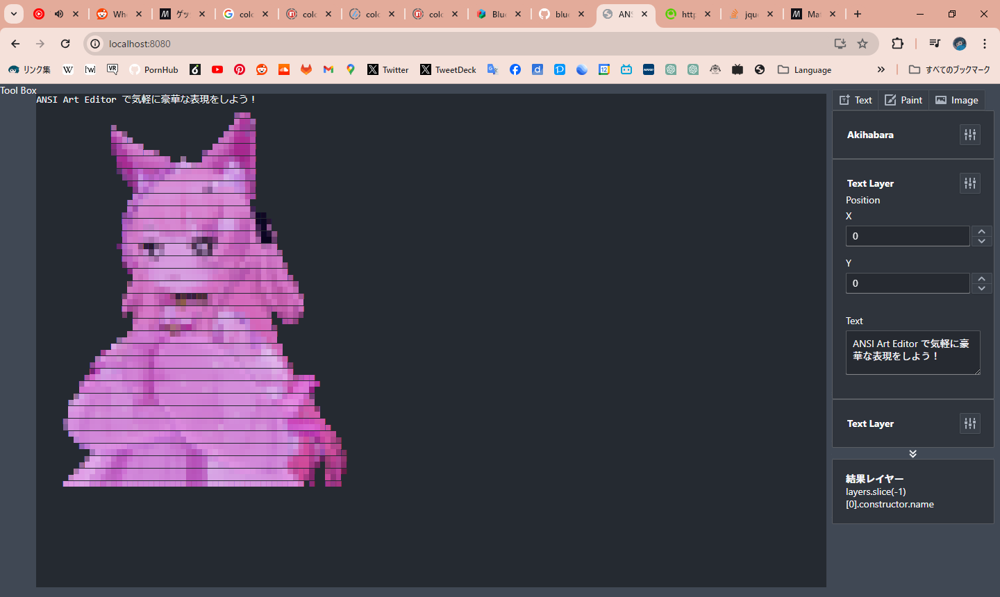

# ANSI Art Editor

This is a simple web-based editor for creating and editing ANSI art.
It is built using React.



## How to run

```console
git clone https://github.com/skytomo221/ansi-art-editor.git
cd ansi-art-editor
npm install
npm run build
npm run serve
```
